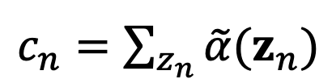

# Lab3 Report

Name: WU YIHANG.      StuID: A0285643W

## E-STEP

In my implementation, this algorithm is divided into 2 parts. 

- The first part is the forward part, where I compute $\tilde\alpha(z_n),p(x_n|z_n),c_n$(the scaling factor), based on these two equations below in the lecture's slides:

  ​                                         
  
  - $p(x_n|z_n)$: I calculate this using  the `scipy.stats.norm.pdf` function from the SciPy library
  - $\tilde\alpha(z_n)$ are calculated before $c_n,\alpha$ in each loop
    - For $\tilde\alpha(z_0)$, it is initialized according to  
    - Then, $\tilde\alpha(z_n)$ can be calculated according to the first equation above.
  - Then we can get $c_n$ using `np.sum(...)`, after which we can get the final $\alpha(z_n) = \tilde\alpha(z_n)/c_n$

- The second part is the backward part, which is easier than the first part. We only need to compute the $\beta$ list according to the equation below: 
  - First, all $\beta(z_n)$ is initialized by 1
  - And then $\tilde\beta(z_n)$ is calculated accoring to this equation.
  - Then we can get the final $\beta(z_n) = \tilde\beta(z_n)/c_{n+1}$

- Finally, we can get the $\gamma(z_n),\xi(z_{n-1},z_n)$, according to the equation:

## M-Step 

In this algorithm, we update those parameters, like $A,\pi_k,\mu_k,\Sigma_k$, accoring to the equation in lecture's slides:

As the variables we need have been calculated in E-step, this step we only need to do some matrix operation to update out parameter.

## PUTTING THEM TOGETHER

In this algorithm, we do iterations, and identify when we can stop the loop. In my implementation, a threshold of 1e-4 is set, and the old value of $\mu,\sigma$ are stored, and then I calculate $abs(value_{new}-value_{new})$ for both new $\mu$ and $\sigma$. It their results are both less than the threshold, we stop the iteration and get out final estimation.
