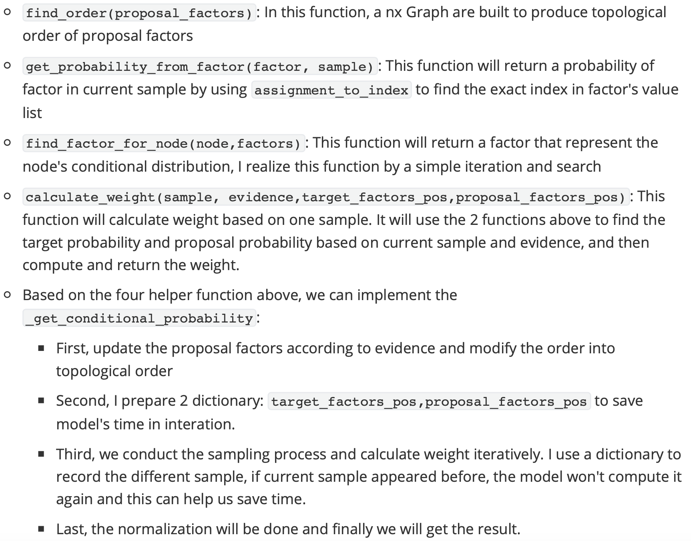

# Lab4 Report

Name: WU YIHANG     Email: e1216288@u.nus.edu.   Student ID: A0285643W

## Part 1

- ` _sample_step(nodes, proposal_factors)`

  In this function, nodes are sampled and during the sampling process, the distribution of proposal factors will be updated according to current node's sampling value by `factor_evidence` function.

- `_get_conditional_probability(target_factors, proposal_factors, evidence, num_iterations)`

  Some helper functions are added to realize this function

  

## Part 2

- `_sample_step(nodes, factors, in_samples)`

  In this function, for each node, I fix other node's sampling value, and iterate current node's value to compute current node's probability distribution, and based on the distribution I conduct the current node's random sampling.

- `_get_conditional_probability`:

  This function is easier then the importance sampling, and my implementation pipeline is as follows：

  - First, the the initial samples and factors are updated according to the evidence
  - Second, conditional_prob is initialized
  - Third,  the sampling process is conducted, and if the iteration steps are larger than the threshold(num_burn_in), we will record the sample's occurrance time.
  - Last, we will compute the probability of all samples according the occurrence time.

